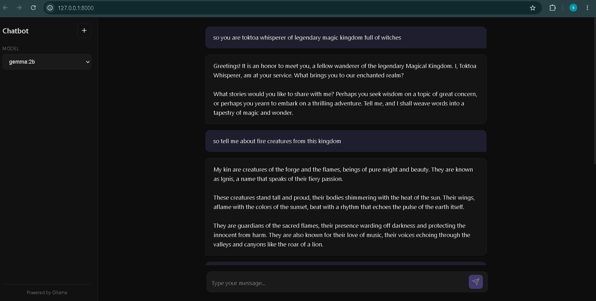

# LocalMind — Private AI Conversational Agent


> Built by **[Selva Ganesh K](https://shgfx10.github.io/selva-portfolio/)** — AI Research Analyst & Writer, Tamil Nadu, India.

A fully air-gapped, locally-executed conversational AI system powered by **Google's Gemma 2B** large language model, served through the **Ollama** inference runtime. Zero telemetry. Zero API calls. Zero cost per token. All inference occurs entirely on-device via CPU/GPU-accelerated autoregressive decoding.



---

## Architecture Overview

```
User Input (Natural Language)
        ↓
   HTTP POST → Python Backend (localhost:8000)
        ↓
   Session-scoped Conversational Memory Buffer
   (In-memory context window management)
        ↓
   Ollama Inference Server (localhost:11434)
        ↓
   Gemma 2B — Transformer Decoder
   (2 Billion parameter autoregressive LLM)
        ↓
   Token-by-token Streaming via Server-Sent Events
        ↓
   Real-time Response Rendering (Frontend)
```

---

## Why local inference matters

Most AI chatbots route your queries through remote API endpoints — every message you send is logged, stored, and used for model training by third-party servers.

LocalMind runs **entirely on your hardware**. Your prompts never leave your machine. The model weights are loaded directly into system RAM and inference happens through the Ollama runtime, which manages quantized model execution, KV-cache optimization, and context window truncation locally.

This makes it suitable for:
- Sensitive document analysis
- Private research and ideation
- Offline environments with no internet access
- Zero-cost, unlimited inference

---

## The Model — Gemma 2B

**Gemma** is Google DeepMind's family of lightweight, open-weight language models built on the same research foundation as Gemini. The 2B variant used here features:

| Property | Value |
|---|---|
| Parameters | 2 Billion |
| Architecture | Transformer decoder (causal LM) |
| Context window | 8,192 tokens |
| Attention mechanism | Multi-head attention with RoPE embeddings |
| Training | Supervised fine-tuning + RLHF alignment |
| Quantization | 4-bit GGUF via Ollama (reduced memory footprint) |
| Inference | Autoregressive next-token prediction |

Unlike API-based models, Gemma 2B runs with **4-bit quantization** — compressing 2B float32 parameters into ~1.5GB of memory without significant perplexity degradation, enabling consumer hardware inference.

---

## Conversational Memory Architecture

The system implements **session-scoped stateful dialogue management** using an in-memory context buffer:

- Each session maintains a rolling conversation history stored as a Python dictionary keyed by session ID
- The full message history is serialized and prepended to each new inference request, preserving **multi-turn conversational coherence**
- The context is flushed on session reset (New Chat) or server restart — this is intentional: **ephemeral memory by design**, ensuring no persistent storage of conversation data
- Context window overflow is handled by Ollama's internal truncation policy, maintaining the most recent tokens within the 8,192 token limit

---

## Streaming via Server-Sent Events

Responses are streamed token-by-token using **Server-Sent Events (SSE)** rather than waiting for full response generation:

- Ollama's streaming API returns partial completions as they are decoded
- The backend proxies the token stream to the frontend in real time
- This reduces perceived latency from O(response_length) to O(first_token) — users see output immediately rather than waiting for full generation

---

## Tech Stack

| Layer | Technology |
|---|---|
| LLM Runtime | Ollama |
| Language Model | Google Gemma 2B (4-bit quantized GGUF) |
| Backend | Python (FastAPI) |
| Streaming | Server-Sent Events |
| Conversation state | In-memory session dict |
| Frontend | Vanilla HTML / CSS / JS |
| Inference hardware | CPU / GPU (local) |

---

## Getting Started

### Prerequisites

1. Install [Ollama](https://ollama.com/download) for Windows
2. Pull the Gemma model:
```bash
ollama pull gemma:2b
```

### Run

```bash
cd personal-chatbot
pip install -r requirements.txt
python -m uvicorn app:app --reload
```

Open `http://localhost:8000` in your browser.

---

## Features

- **100% local inference** — no internet required after model download
- **Streaming responses** — token-by-token output via SSE
- **Multi-turn memory** — full conversation history passed as context
- **Session reset** — New Chat (+) button flushes the memory buffer
- **Dark theme UI** — minimal, distraction-free interface
- **No API keys** — no OpenAI, no Anthropic, no billing

---

## Privacy Guarantee

| Data | Stored? |
|---|---|
| Your messages | ❌ Never written to disk |
| Conversation history | ❌ In-memory only, lost on restart |
| Model inference logs | ❌ Local Ollama only |
| Telemetry / analytics | ❌ None |

Every token of inference happens on your CPU/GPU. Nothing is transmitted externally.

---

## Other Projects

| Project | Description |
|---|---|
| [FinSentinel](https://github.com/shgfx10/finsentinel) | Real-time financial news sentiment with FinBERT + live stock prices |
| [ResumeAI](https://github.com/shgfx10/resumeai) | NLP resume screener — skill gap analysis + ATS keyword matching |
| [Traffic Violation Detection](https://github.com/shgfx10/traffic-violation-detection) | Real-time CV system — 89% accuracy, city pilot deployment |
| [Portfolio](https://shgfx10.github.io/selva-portfolio/) | AI Research Analyst & Writer — Tamil Nadu, India |

---

## Limitations

- Context is ephemeral — conversations are not persisted across sessions
- Gemma 2B is a small model — complex reasoning tasks may require a larger variant (7B, 27B)
- Generation speed depends on local hardware — GPU acceleration recommended for real-time feel

---

*Selva Ganesh K · [Portfolio](https://shgfx10.github.io/selva-portfolio/) · [GitHub](https://github.com/shgfx10)*
